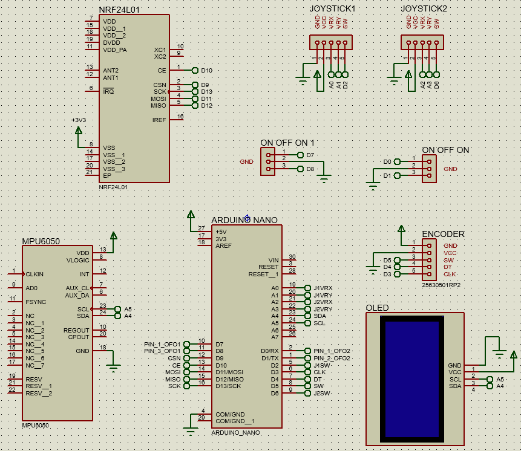
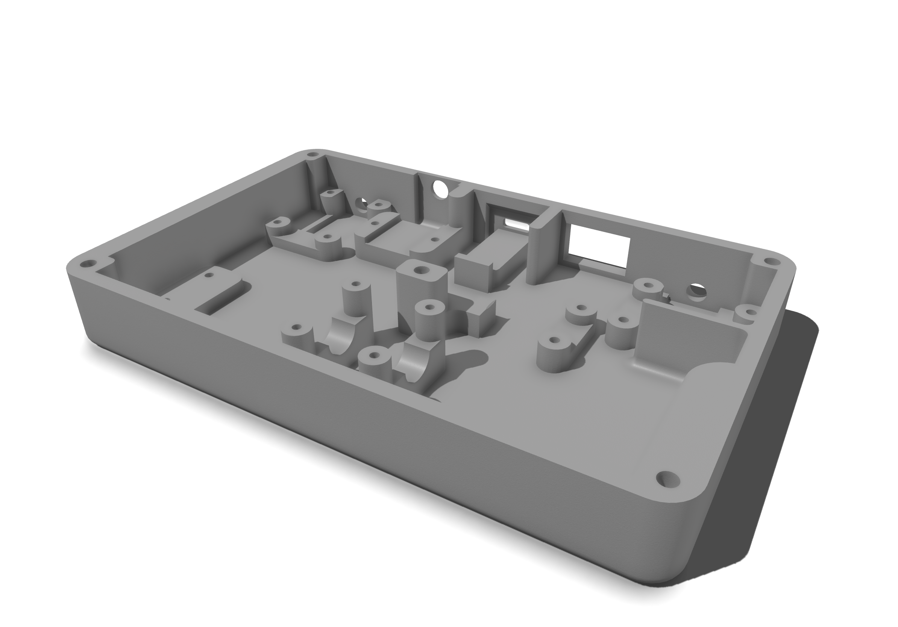
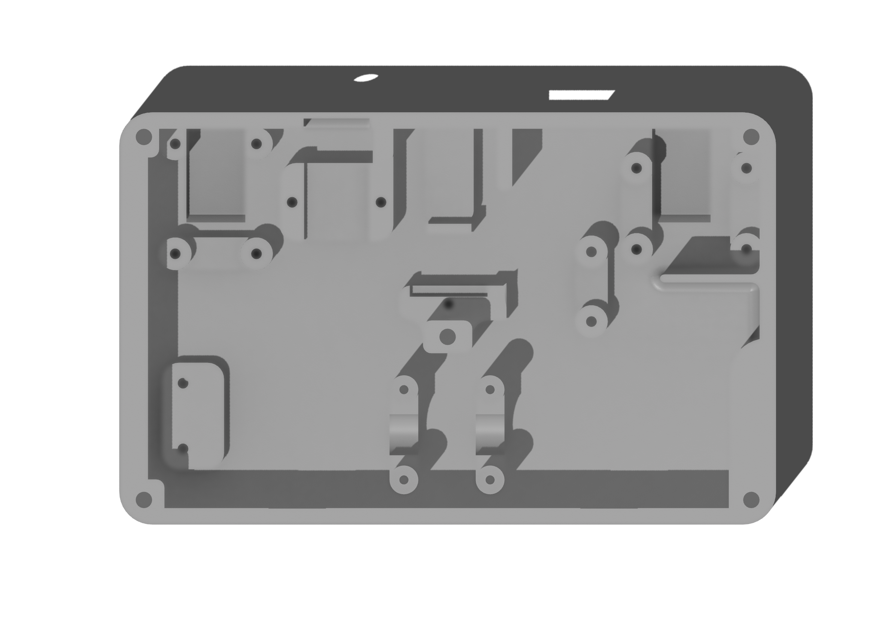
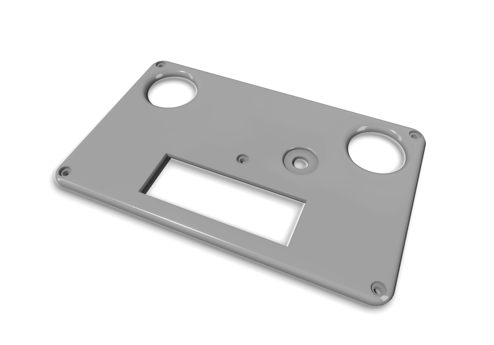
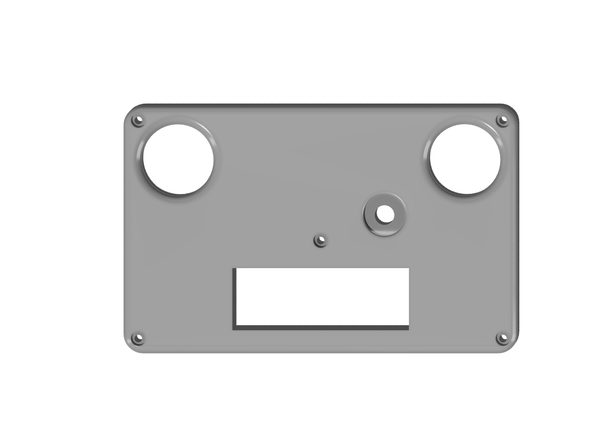
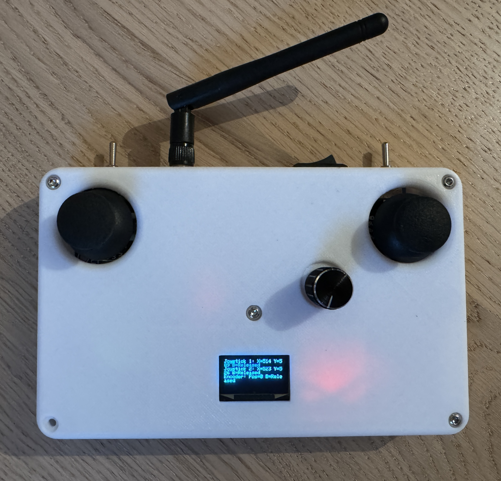

# Radio-Transmitter
This project is an Arduino-based remote control system designed for wirelessly piloting various projects, including drones, robots, and more.

***Project date : 2024***

 

# Summary

* **[Summary](#summary)**
* **[Schematic](#schematic)**
* **[Material list](#material-list)**
* **[3D Design](#3d-design)**
* **[Assembled Remote Control](#assembled-remote-control)**
* **[Credits](#credits)**

 

# Schematic
Description of the circuit schematic, created in Proteus.

<b>Schematic</b>

	

# Material list

List of materials needed for the project :

* [**Arduino Pro Mini**](https://docs.arduino.cc/retired/boards/arduino-pro-mini/) : A compact and low-power microcontroller board based on the ATmega328P.
* [**FTDI Adapter**](https://ftdichip.com/wp-content/uploads/2020/08/DS_FT232R.pdf) : An interface module used for programming the Arduino Pro Mini.
* [**Joystick KY-023**](https://naylampmechatronics.com/img/cms/Datasheets/000036%20-%20datasheet%20KY-023-Joy-IT.pdf) :  Used for controlling the direction and movement inputs.
* [**MPU6050**](https://invensense.tdk.com/wp-content/uploads/2015/02/MPU-6000-Datasheet1.pdf) : A 6-axis motion tracking device combining a 3-axis gyroscope and a 3-axis accelerometer for precise motion sensing.
* [**TP4056**](https://dlnmh9ip6v2uc.cloudfront.net/datasheets/Prototyping/TP4056.pdf) : A lithium battery charging module with protection circuitry.
* [**NRF24L01+**](https://www.sparkfun.com/datasheets/Components/SMD/nRF24L01Pluss_Preliminary_Product_Specification_v1_0.pdf) : A 2.4GHz wireless transceiver module, used for high-speed data transmission and reception between devices.
* [**ON-OFF-ON Switch MTS-103**](https://www.electronicoscaldas.com/datasheet/MTS-SMTS-Series.pdf) : A toggle switch with three positions.
* [**Lithium Battery**](https://fr.aliexpress.com/item/1005006163347585.html?spm=a2g0o.order_list.order_list_main.541.bad55e5bJhcdJm&gatewayAdapt=glo2fra) : A rechargeable lithium-ion battery providing 350mAh capacity at 3.7V, supplying power to the remote control.
* [**OLED Display SSD1306**](https://cdn-shop.adafruit.com/datasheets/SSD1306.pdf) : OLED screen using I2C protocol, displaying various information and status messages.
* [**NRF24L01 Wireless Adapter Module 3.3V**](https://protosupplies.com/product/nrf24l01-breakout-adapter-with-voltage-regulator/) : A module to facilitate wireless communication for the NRF24L01 at 3.3V.

Additionally, you will need filament for 3D printing, an ON-OFF switch for power supply, electrical wires to connect components, threaded inserts, and screws.

 

# 3D Design

The 3D model for the controller box was printed using a Creality Ender 3 3D printer. 

I used PLA material to print my version.

<b>Case</b>

	

	

<b>Cover</b>

	

	

The STL files for the case and the cover can be found in the STL directory : **`case_3D.stl`** and **`cover_3D.stl`**.

# Assembled Remote Control

This section provides a visual overview of the completed project, demonstrating the layout and design.

	

	

#  Credits
* [**Lorenzo**](https://github.com/MrZouu) : Creator of the project.
* [**Emilostuff**](https://www.youtube.com/watch?v=I6TKGMbHcfo&list=WL&index=1&t=24s) : Video Inspiration
