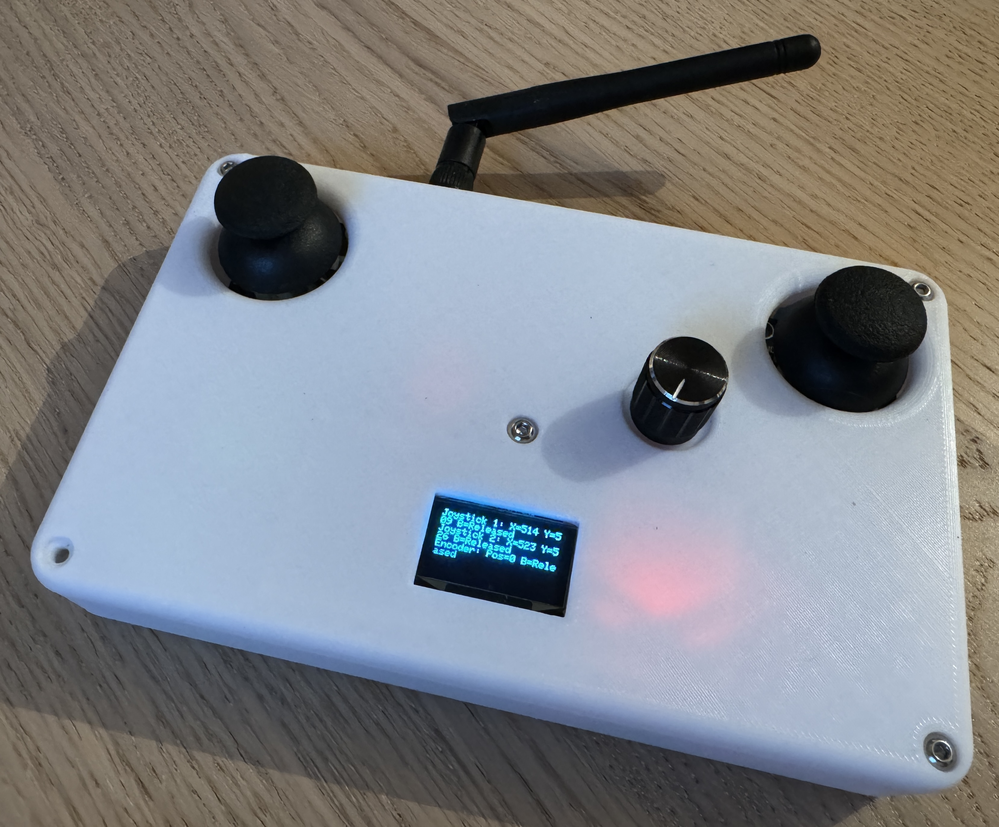

# Radio-Transmitter
This project is an Arduino-based remote control system designed for wirelessly piloting various projects, including drones, robots, and more.

***Project date : 2024***

 

# Summary

* **[Summary](#summary)**
* **[Schematic](#schematic)**
* **[Material list](#material-list)**
* **[3D Design](#3d-design)**
* **[Assembled Remote Control](#assembled-remote-control)**
* **[Credits](#credits)**

 

# Schematic
Description of the circuit schematic, created in Proteus.

<b>Schematic</b>

	

# Material list

List of materials needed for the project :

* [**Arduino Pro Mini**](https://docs.arduino.cc/retired/boards/arduino-pro-mini/) : A compact and low-power microcontroller board based on the ATmega328P.
* [**FTDI Adapter**](https://ftdichip.com/wp-content/uploads/2020/08/DS_FT232R.pdf) : An interface module used for programming the Arduino Pro Mini.
* [**Joystick KY-023**](https://naylampmechatronics.com/img/cms/Datasheets/000036%20-%20datasheet%20KY-023-Joy-IT.pdf) :  Used for controlling the direction and movement inputs.
* [**MPU6050**](https://invensense.tdk.com/wp-content/uploads/2015/02/MPU-6000-Datasheet1.pdf) : A 6-axis motion tracking device combining a 3-axis gyroscope and a 3-axis accelerometer for precise motion sensing.
* [**TP4056**](https://dlnmh9ip6v2uc.cloudfront.net/datasheets/Prototyping/TP4056.pdf) : A lithium battery charging module with protection circuitry.
* [**NRF24L01+**](https://www.sparkfun.com/datasheets/Components/SMD/nRF24L01Pluss_Preliminary_Product_Specification_v1_0.pdf) : A 2.4GHz wireless transceiver module, used for high-speed data transmission and reception between devices.
* [**ON-OFF-ON Switch MTS-103**](https://www.electronicoscaldas.com/datasheet/MTS-SMTS-Series.pdf) : A toggle switch with three positions.
* [**Lithium Battery**](https://fr.aliexpress.com/item/1005006163347585.html?spm=a2g0o.order_list.order_list_main.541.bad55e5bJhcdJm&gatewayAdapt=glo2fra) : A rechargeable lithium-ion battery providing 350mAh capacity at 3.7V, supplying power to the remote control.
* [**OLED Display SSD1306**](https://cdn-shop.adafruit.com/datasheets/SSD1306.pdf) : OLED screen using I2C protocol, displaying various information and status messages.
* [**NRF24L01 Wireless Adapter Module 3.3V**](https://protosupplies.com/product/nrf24l01-breakout-adapter-with-voltage-regulator/) : A module to facilitate wireless communication for the NRF24L01 at 3.3V.

Additionally, you will need filament for 3D printing, an ON-OFF switch for power supply, electrical wires to connect components, threaded inserts, and screws.

 

# Technical Overview

**NRF24L01+** :  highly efficient 2.4GHz wireless transceiver module designed for short-range communication.
* **Frequency Range**: Operates on frequencies from 2.400GHz to 2.525GHz.
* **Channel Resolution**: The RF channel frequency setting can be adjusted with a programming resolution of 1MHz.
  
* **Operational Modes**: The module can be configured in power down, standby, RX (receive), or TX (transmit) mode :
  * *Power Down Mode* : nRF24L01+ is disabled using minimal current consumption.
  * *Standby-I mode* : Only part of the crystal oscillator is active. Change to active modes only happens if CE is set high.
  * *Standby-II mode* : Extra clock buffers are active. Enters standby-II mode if CE is held high on a PTX device with an empty TX FIFO.
  * *RX mode* : nRF24L01+ radio is used as a receiver. Must have the PWR_UP bit, PRIM_RX bit and the CE pin set high.
  * *TX mode* : Active mode for transmitting packets. PWR_UP bit set high, PRIM_RX bit set low, a payload in the TX FIFO and a high pulse on the CE. If CE = 0, nRF24L01+ returns to
standby-I mode.

**Custom Frequency Setting**:

Modify the operational frequency by configuring the RF_CH register.
* `Frequency (MHz) = 2400 + RF_CH (MHz)` :  setting RF_CH to 2 will configure the module to operate at 2.402GHz.
So, the module supports 125 selectable channels within its 2.400GHz to 2.525GHz range, each with a 1MHz resolution.

# 3D Design

The 3D models used in this project are modifications of the original design by [Emilostuff](https://www.youtube.com/watch?v=I6TKGMbHcfo&list=WL&index=1&t=24s). 

These modifications were made using Shapr3D to better fit the specific components and layout of the remote control.

<b>Case</b>

	

	

<b>Cover</b>

	

	

The STL files for the case and the cover can be found in the STL directory : **`case_3D.stl`** and **`cover_3D.stl`**.

# Assembled Remote Control

This section provides a visual overview of the completed project, demonstrating the layout and design.

The 3D model for the controller box was printed using a Creality Ender 3 3D printer. I used PLA material to print my version.

	

	

#  Credits
* [**Lorenzo**](https://github.com/MrZouu) : Creator of the project.
* [**Emilostuff**](https://www.youtube.com/watch?v=I6TKGMbHcfo&list=WL&index=1&t=24s) : Video Inspiration
